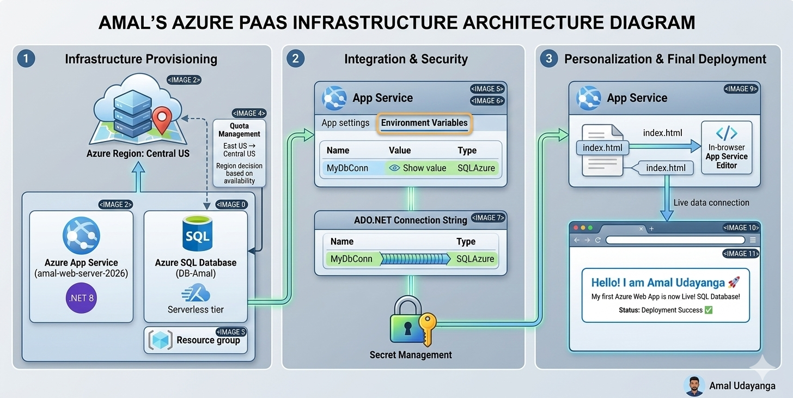
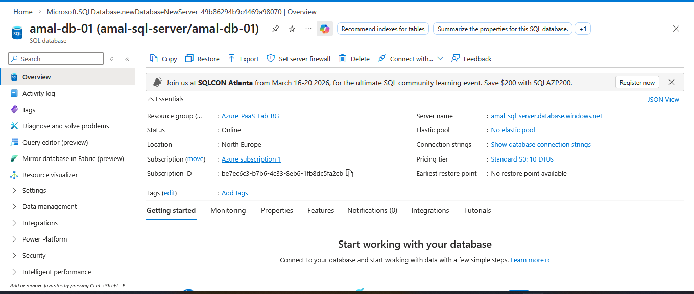
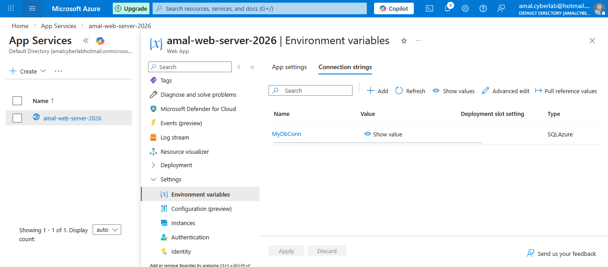
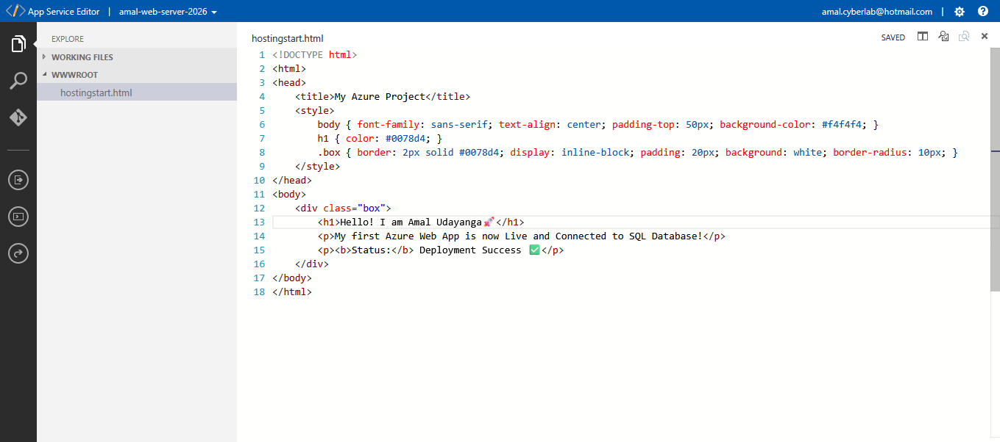
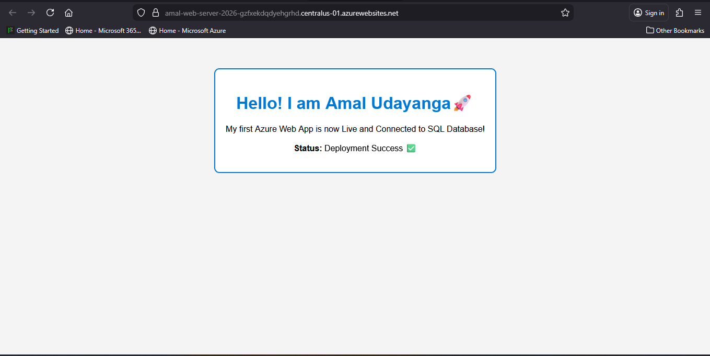

# ☁️ Azure PaaS Web Application Architecture (App Service + SQL Database)

This project demonstrates the deployment of a **production-style Platform-as-a-Service (PaaS) architecture** on Microsoft Azure.

The solution integrates a **.NET 8 Web Application hosted on Azure App Service** with a **managed Azure SQL Database**, providing a scalable and secure cloud-native environment without managing infrastructure.

---

# 🏗️ Architecture Overview

The following diagram illustrates the full architecture and deployment workflow.

### Architecture Flow

Internet Users  
│  
▼  
Azure App Service (Web Application)  
│  
▼  
Azure SQL Database (Managed Database)

---

# ⚙️ Technology Stack

| Component | Technology |
|-----------|-----------|
| Cloud Platform | Microsoft Azure |
| Web Hosting | Azure App Service |
| Runtime | .NET 8 (LTS) |
| Database | Azure SQL Database |
| Deployment | Azure Portal |
| Security | Environment Variables / Secure Connection Strings |

---

# 🚀 Deployment Process

## Phase 1 — Infrastructure Provisioning

All resources were deployed within a dedicated **Azure Resource Group**.

A managed **Azure SQL Server** instance was created and configured with firewall rules to allow secure connectivity from Azure services.

### Configuration Details

Server Name: `amal-sql-server`  
Database Name: `amal-db-01`  
Service Tier: Standard S0 (10 DTUs)

---

## Phase 2 — Secure Application Integration

For security best practices, the database connection string was **not stored inside application code**.

Instead, it was configured using **App Service Environment Variables**.

| Setting | Value |
|------|------|
| Variable Name | MyDbConn |
| Type | SQLAzure |

This ensures sensitive credentials remain protected.

---

## Phase 3 — Application Deployment

The web application was deployed to **Azure App Service**.

The **App Service in-browser editor** was used to verify the connection between the application and the backend SQL database.

---

# 📊 Deployment Verification

After deployment, the application dashboard confirmed successful database connectivity.

Application Status: Running ✔️  
Database Connection: Successful ✔️  

### Live Application

https://amal-web-server-2026.azurewebsites.net

---

# 🛡️ Security Considerations

The following security practices were implemented:

• Secure connection strings stored in App Service configuration  
• SQL firewall rules restricting access  
• Separation of application and database layers  
• No hardcoded credentials in source code  

---

# 📚 Key Learning Outcomes

This project demonstrates practical knowledge of:

• Deploying applications using **Azure PaaS services**  
• Integrating **Azure App Service with Azure SQL Database**  
• Implementing secure configuration management  
• Designing scalable cloud-native architectures  

---

# 👨‍💻 Author

**Amal Udayanga Basnayake**

Cloud & Cybersecurity Enthusiast  
Preparing for **AZ-500: Azure Security Engineer Associate**

Project Date: March 2026
